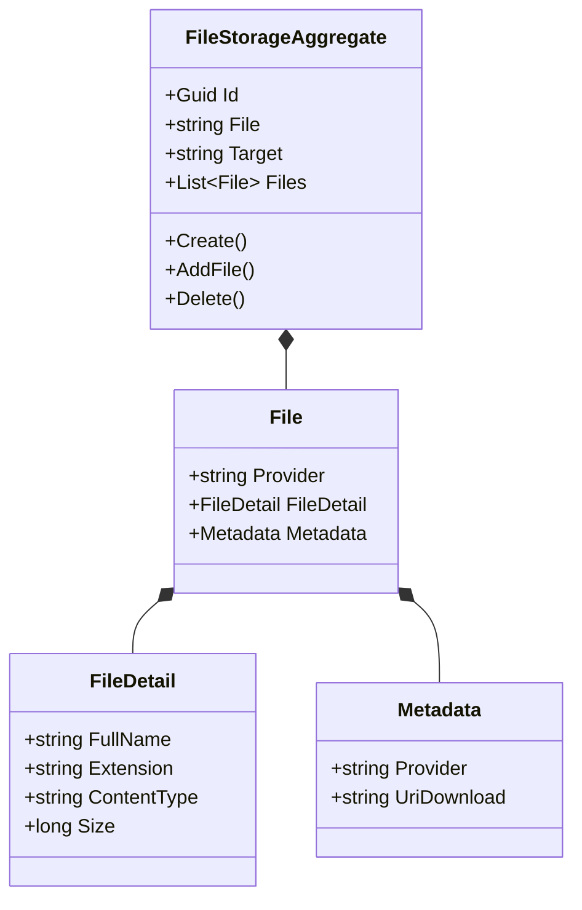
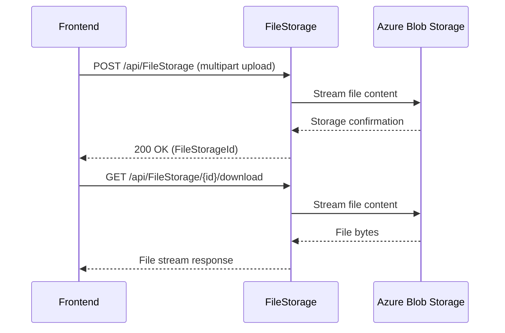

# FileStorage Microservice

## Overview

The FileStorage microservice provides file upload and download capabilities for the platform. It acts as a proxy between consuming microservices and the underlying cloud storage provider (Azure Blob Storage, Azure File Storage, or local filesystem). Files are streamed directly through the service without full buffering, supporting large file uploads. Each upload is tracked as a `FileStorageAggregate` that records the file's identity, target context, and provider metadata. Other microservices reference file storage records by their aggregate ID rather than direct cloud URLs, maintaining abstraction over the storage backend.

## Business Context

A multi-tenant platform handles many types of file uploads: profile pictures, evidence attachments, legal documents, inspection photos, and more. Without a centralized file service, each microservice would need to implement its own cloud storage integration, manage signed URLs, handle multipart uploads, and track file metadata -- leading to inconsistent implementations and security risks.

The FileStorage microservice solves this by providing a single upload/download proxy. Consuming microservices never interact directly with the cloud provider; they upload through this service and receive a FileStorageId that they store in their own domain. Downloads are also proxied, with authorization checks ensuring that only users from the owning tenant can access files.

For a new developer: this is the "filing cabinet" of the platform. Whenever any part of the system needs to store or retrieve a file, it goes through here.

## Ubiquitous Language

| Term         | Definition                                                                                                                    |
| ------------ | ----------------------------------------------------------------------------------------------------------------------------- |
| FileStorage  | An aggregate tracking a file upload operation. Links a logical file identity to its physical storage across one or more providers. |
| File         | A value object containing the file's metadata (provider, file detail, download URI) for a specific storage location.           |
| FileDetail   | A value object with the file's physical attributes: full name, extension, content type, and size in bytes.                     |
| Metadata     | A value object holding provider-specific information and the download URI for a stored file.                                    |
| Target       | A string identifying the context where the file belongs (e.g., "profile-picture", "evidence", "document").                     |
| Provider     | The storage backend: AzureBlob, AzureFile, or Local. Configured per environment.                                              |
| Upload       | The process of streaming file content from a client through this service to the configured storage provider.                    |
| Download     | The process of streaming file content from the storage provider through this service to the requesting client.                  |
| Renowned     | A display-friendly file name that may differ from the physical file name (renamed by the uploader).                            |
| MultipartReader | The ASP.NET Core mechanism used to stream multipart form data without buffering the entire file in memory.                  |
| SignedURL    | A time-limited URL for direct access to a file in cloud storage. Generated internally but not exposed to clients.              |
| FileStorageId| The unique identifier of a FileStorageAggregate, stored by consuming microservices as their file reference.                    |
| AddFile      | The domain operation that records a new file variant (different provider or version) within an existing aggregate.              |
| Soft Delete  | Logical removal of a file storage record without physically deleting the cloud object.                                         |
| Tenant       | The organization that owns the file. All file access is tenant-scoped.                                                         |

## Domain Model

The FileStorage domain has a single aggregate that tracks uploaded files. Each aggregate can contain multiple `File` value objects representing the same logical file stored in different providers or versions.

## Data Dictionary

### FileStorageAggregate

Tracks a file upload and its storage locations.

| Field     | Type         | Description                                            |
| --------- | ------------ | ------------------------------------------------------ |
| Id        | Guid         | Unique identifier (referenced by consuming services)   |
| File      | string       | Logical file name                                      |
| Target    | string       | Context identifier (e.g., "profile-picture")           |
| Files     | List\<File\> | Physical storage entries for this logical file         |
| Tenant    | Guid         | Owning tenant                                          |
| IsActive  | bool         | Whether the file is accessible                         |
| CreatedBy | Guid         | User who uploaded the file                             |
| CreatedAt | Instant      | UTC timestamp of upload                                |

### File (Value Object)

A specific storage location for the file.

| Field      | Type       | Description                              |
| ---------- | ---------- | ---------------------------------------- |
| Provider   | string     | Storage backend (AzureBlob, Local, etc.) |
| FileDetail | FileDetail | Physical file attributes                 |
| Metadata   | Metadata   | Provider metadata and download URI       |

## Integration Architecture

FileStorage is a utility service called by any microservice that needs file operations. It proxies all storage interactions, hiding the cloud provider from consumers.

## Event Catalog

### Events Produced

| Event                         | Trigger      | Purpose                                  |
| ----------------------------- | ------------ | ---------------------------------------- |
| `FileStorageCreatedDomainEvent`| `Create()`  | New file upload tracked                  |
| `FileStorageAddedDomainEvent`  | `AddFile()` | New provider entry added to existing file|
| `FileStorageDeletedDomainEvent`| `Delete()`  | File record soft-deleted                 |

## API Reference

Base path: `/api`

### FileStorage

| Method | Path                                  | Description                              | Auth            |
| ------ | ------------------------------------- | ---------------------------------------- | --------------- |
| GET    | `/api/FileStorage`                    | Paginated list of file records           | Bearer + Tenant |
| GET    | `/api/FileStorage/{id}`               | Get file metadata by ID                  | Bearer + Tenant |
| POST   | `/api/FileStorage`                    | Upload a file (multipart/form-data)      | Bearer + Tenant |
| GET    | `/api/FileStorage/{id}/download`      | Download a file by ID                    | Bearer + Tenant |
| DELETE | `/api/FileStorage/{id}`               | Soft-delete a file record                | Bearer + Tenant |

All endpoints return RFC 7807 Problem Details on error.

## Key Design Decisions

- **Proxy pattern, not signed URLs:** Clients never receive direct cloud URLs. All uploads and downloads flow through this service, enabling tenant-scoped authorization and provider abstraction.

- **Streaming without buffering:** The upload endpoint uses `MultipartReader` to stream directly to the storage provider without buffering the entire file in memory, supporting large files with minimal memory pressure.

- **Duplicate detection by FullName + Provider:** The `AddFile` operation rejects files that already exist with the same full name and provider combination, preventing accidental duplicates while allowing the same file in different providers.

- **FileDetail.Size > 0 guard:** The domain rejects zero-byte files, ensuring that storage operations always have content to write.

- **Provider configured per environment:** The storage backend (AzureBlob, AzureFile, Local) is selected via configuration, not per-request. This enables different backends for development vs production.

- **No request body size limit:** Kestrel's `MaxRequestBodySize` is set to null to support arbitrarily large file uploads. Size limits should be enforced at the infrastructure level (ingress, WAF).

## Related Microservices

| Microservice | Direction | Integration Point                                             |
| ------------ | --------- | ------------------------------------------------------------- |
| Users        | Inbound   | Stores profile pictures via upload                            |
| Emails       | Inbound   | Attachment files may be stored here                           |
| Any Service  | Inbound   | Any microservice can store/retrieve files via this service    |
